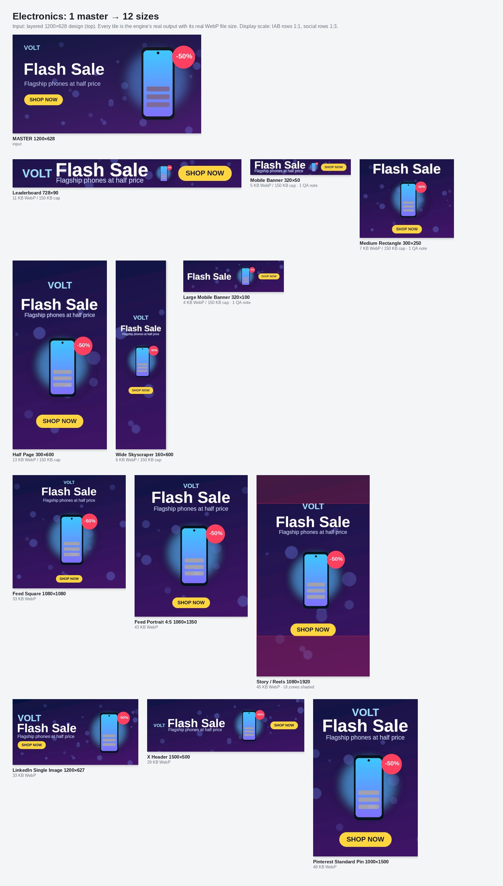
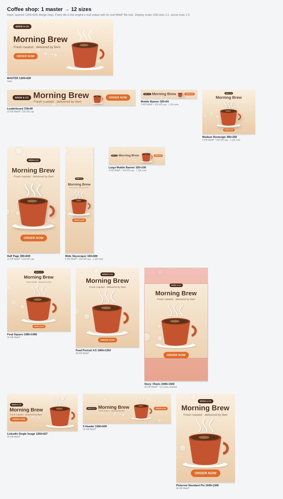
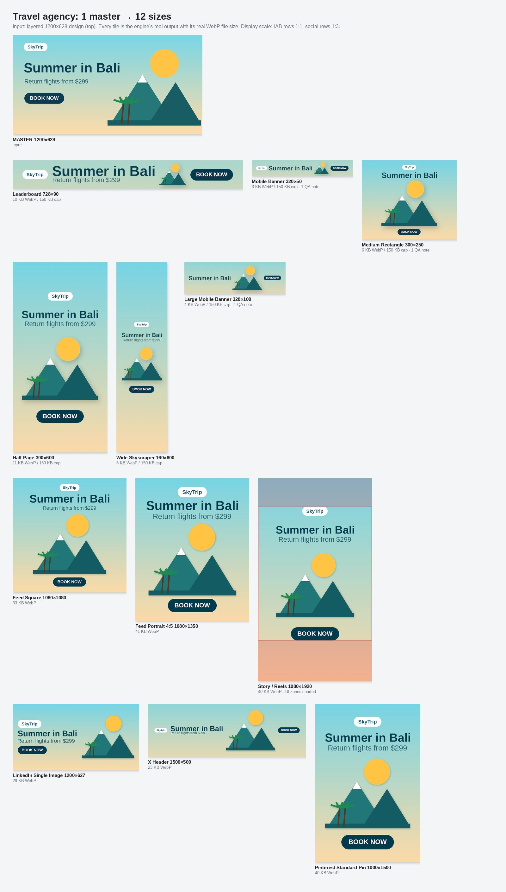
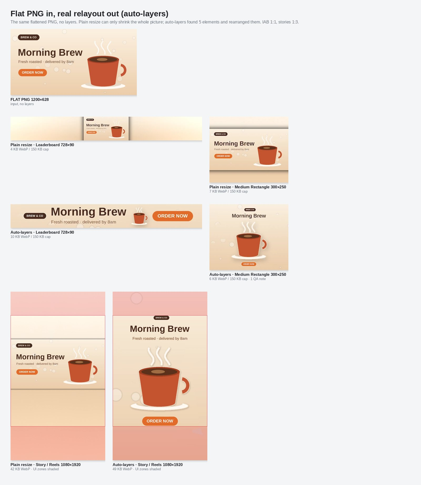
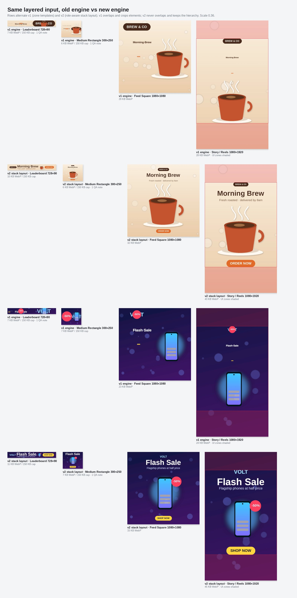
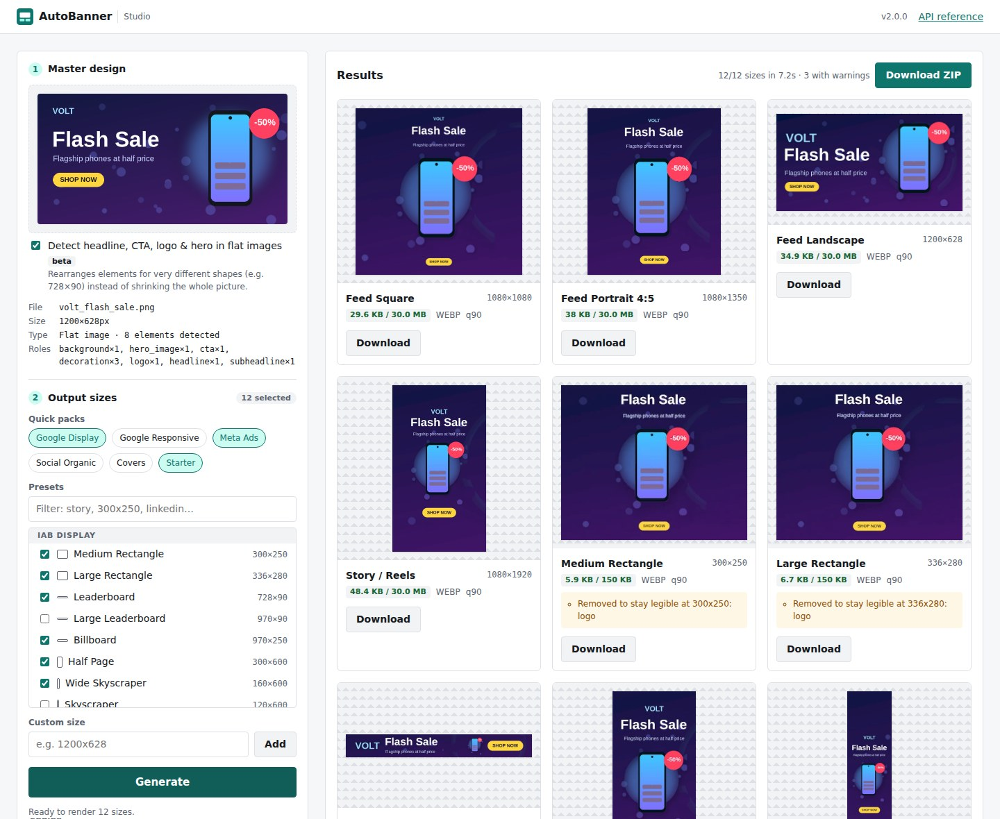

# AutoBanner

[](https://github.com/vansyson1308/smartresizeimage/actions/workflows/ci.yml)


**Một thiết kế gốc → mọi kích thước quảng cáo & mạng xã hội, trong vài giây.**

AutoBanner nhận 1 banner gốc (PSD nhiều layer hoặc PNG/JPG/WEBP) và tự **bố cục lại** cho
40+ kích thước chuẩn của Google Display, Meta, TikTok, LinkedIn, X, YouTube, Pinterest…
Logo, chữ, CTA và mascot được giữ nguyên (không méo, không cắt), phần nền được mở rộng
thông minh, mỗi file xuất ra **nằm dưới giới hạn dung lượng của từng mạng quảng cáo**
và được **kiểm tra vùng an toàn** (safe zone) trước khi bạn tải về.

> *English: AutoBanner turns one master banner into every ad and social size — brand
> elements preserved, platform safe zones respected, file-size caps met. Studio UI,
> REST API, CLI and Docker image included. See [docs/API.md](docs/API.md).*



---

## Demo: kết quả thật, không phải ảnh minh họa

Mọi ô ảnh trong các bảng dưới đây là **output thật của engine**, được tạo bởi
[`backend/tools/make_demo.py`](backend/tools/make_demo.py) — chạy lại
`python backend/tools/make_demo.py` là ra lại **đúng từng byte** các ảnh này. Dung lượng
ghi dưới mỗi ô là kích thước file WebP thật sau khi xuất; vùng tô đỏ trên Story là vùng
UI của Instagram/Facebook mà engine đã chủ động tránh (chỉ vẽ để minh họa, không có
trong file xuất). Banner gốc là thiết kế mẫu vẽ bằng code (3 phong cách khác nhau),
không phải ảnh chỉnh tay.

### 1 master → 12 size quảng cáo (PSD nhiều layer)

<table>
<tr>
<td width="33%"><a href="docs/demo/showcase_coffee.jpg"></a></td>
<td width="33%"><a href="docs/demo/showcase_tech.jpg"></a></td>
<td width="33%"><a href="docs/demo/showcase_travel.jpg"></a></td>
</tr>
<tr>
<td align="center">Quán cà phê</td><td align="center">Điện tử (sticker "-50%" bám theo sản phẩm)</td><td align="center">Du lịch</td>
</tr>
</table>

Điều cần nhìn: leaderboard 728×90 xếp thành 1 hàng (logo · chữ · hình · CTA), dọc 1080×1920
xếp chồng và né vùng UI, 300×250 tự bỏ logo hoặc sub-copy để chữ còn đọc được (và **báo
lại** trong QA), mọi file IAB đều dưới trần 150 KB của Google Display.

### Ảnh phẳng PNG cũng bố cục lại được (auto-layers)



Cùng một file PNG đã flatten, không có layer nào. Hàng trên: resize thông thường chỉ có
thể thu nhỏ cả bức ảnh (leaderboard 728×90 gần như không đọc được). Hàng dưới: auto-layers
tự tách headline, sub-copy, CTA, logo, hình minh họa + dựng lại nền sạch, rồi bố cục lại.

### Engine cũ vs engine mới (cùng input nhiều layer)



Engine v1 (zone template) chồng logo lên chữ, cắt/đè sticker, chữ nhỏ tới mức biến mất.
Engine v2 (stack layout) không bao giờ chồng lấn, giữ thứ bậc chữ và bám safe zone.

### Studio



Ảnh chụp màn hình Studio đang chạy thật (Chromium headless). Kéo-thả 1 file PNG phẳng →
Studio phát hiện 8 phần tử → chọn pack *Meta Ads* + *Google
Display* → 12 size trong ~7 giây, mỗi thẻ hiện dung lượng / trần của mạng và ghi chú QA.

---

## Vì sao AutoBanner?

| Vấn đề của team marketing | AutoBanner giải quyết |
|---|---|
| Designer mất hàng giờ resize 1 banner ra 15–30 size cho mỗi chiến dịch | Chọn **pack** (vd. `google-display`, `meta-ads`) → nhận ZIP đủ size trong vài giây |
| Google Display từ chối file > 150 KB | Tự dò chất lượng JPEG/WebP (hoặc giảm màu PNG) để **vừa ngân sách KB**, báo rõ nếu không đạt |
| Chữ/CTA bị che bởi thanh UI của Story/Reels/TikTok | Tự dời nhóm phần tử chính vào **safe zone** và cảnh báo trong báo cáo QA |
| Resize kéo giãn làm méo logo, mascot | Phần tử thương hiệu được scale **đồng đều**, nền được mở rộng bằng inpainting |
| Không tích hợp được vào pipeline | **REST API** có API key, job bất đồng bộ, `manifest.json` máy đọc được, **CLI** trả exit code cho CI/CD |

## Tính năng

- **Studio web** (không cần cài gì thêm): kéo-thả file, chọn pack/preset, xem trước từng size, tải từng file hoặc ZIP.
- **REST API** (FastAPI, OpenAPI tại `/docs`): `/v1/render` (đồng bộ, trả ZIP), `/v1/jobs` (bất đồng bộ, có tiến độ), `/v1/analyze`, `/v1/presets`.
- **CLI** `autobanner`: render hàng loạt nhiều file, nhiều pack, xuất thư mục hoặc ZIP.
- **Thư viện 40+ preset** chuẩn IAB / Google Ads / Meta / TikTok / LinkedIn / X / YouTube / Pinterest / Web / Email, gom thành **pack** theo chiến dịch.
- **Xuất PNG / JPEG / WebP** với **ngân sách dung lượng** (tự áp giới hạn của từng mạng hoặc tự đặt `max_kb`).
- **QA tự động** cho từng file: vi phạm safe zone, chữ quá nhỏ (< 9px), quality gate, dung lượng.
- **Layout engine theo vai trò (stack layout)**: mỗi size được xếp theo 3 kiểu chuẩn của designer — *strip* (728×90: logo | chữ | hero | CTA), *landscape* (cột chữ cạnh hero) và *vertical* (logo, chữ, hero, CTA xếp dọc). Không chồng lấn, giữ thứ bậc chữ, không bao giờ kéo méo layer; khi size quá nhỏ sẽ bỏ bớt nội dung phụ (body → sub → logo), **không bao giờ bỏ headline/CTA**.
- **Auto-layers cho ảnh phẳng (beta)**: PNG/JPG xuất sẵn được tự tách thành headline, sub, CTA, logo, hero + nền sạch, để bố cục lại như PSD thay vì thu nhỏ cả ảnh.
- **2 chế độ**:
  - `phase21` — *Relayout*: nhanh, deterministic; PSD (hoặc ảnh phẳng đã auto-layers) được bố cục lại theo vai trò, ảnh phẳng không tách lớp dùng content-aware fit.
  - `phase3` — *Redesign*: đặt “điểm neo thương hiệu” trước rồi vẽ lại nền + decor phong cách flat illustration.
- **Sẵn sàng production**: API key (so sánh hằng thời gian), rate limit, giới hạn upload, kiểm tra magic-byte, chống decompression bomb, request ID, Prometheus `/metrics`, log JSON, Docker non-root + read-only.

## Hiệu năng (CPU, 1 luồng)

| Tác vụ (nguồn 1200×628) | v1 | v2 |
|---|---:|---:|
| Relayout → Story 1080×1920 | 7.1 s | **0.9 s** |
| Relayout → 8 size Google Display | 3.0 s | **1.2 s** |
| Redesign (phase3) → Story 1080×1920 | 36 s | **13 s** |

### Chất lượng layout (benchmark Phase 2.1, 12 case × 3 size)

| | Engine cũ | Stack layout (v2) |
|---|---:|---:|
| Pass rate | 75.0% | **88.9%** |
| Điểm trung bình | 39.2 | **56.4** |
| Số lần render có phần tử chồng nhau | 36 / 36 | **0 / 36** |

Auto-layers trên bộ banner phẳng mẫu (`backend/tools/flat_banner_samples.py`): phát hiện đúng vị trí + vai trò **106/112** phần tử (95%).

---

## Bắt đầu nhanh

### Cách 1 — Docker (dễ nhất)

```bash
git clone https://github.com/vansyson1308/smartresizeimage.git
cd smartresizeimage
cp .env.example .env        # đặt AUTOBANNER_API_KEYS nếu public ra internet
docker compose up --build
```

Mở **http://localhost:7860** (Studio) — tài liệu API ở **http://localhost:7860/docs**.

### Cách 2 — Python (Windows / macOS / Linux)

Yêu cầu Python 3.10+.

```bash
cd smartresizeimage/backend
python -m venv .venv
# macOS/Linux:  source .venv/bin/activate
# Windows:      .venv\Scripts\activate
pip install -r requirements.txt
python -m app.main            # Studio + API tại http://localhost:7860
```

Muốn dùng AI (phân loại CLIP + inpainting LaMa, tải vài GB): `pip install -r requirements-ai.txt` và đặt `AUTOBANNER_USE_AI=true`.

---

## Dùng Studio

1. **Master design** — kéo-thả PSD/PNG/JPG/WEBP. Studio hiển thị kích thước, loại (layered/flat) và vai trò các layer phát hiện được. Với ảnh phẳng, ô *Detect headline, CTA, logo & hero* (bật sẵn) sẽ tách phần tử để bố cục lại.
2. **Output sizes** — bấm một pack (vd. *Meta Ads*), tick thêm preset, hoặc thêm size tùy chỉnh `1200x628`.
3. **Output settings** — chọn engine, định dạng, giới hạn KB (để trống = theo mạng quảng cáo).
4. **Generate** — xem tiến độ, preview từng size kèm dung lượng / ngân sách và cảnh báo QA, tải từng file hoặc cả ZIP.

> Mẹo: PSD có đặt tên layer rõ ràng (`logo`, `headline`, `cta`, `hero`, `bg`…) cho kết quả tốt nhất.
> Với ảnh phẳng dùng Redesign, chọn preset anchor *Mascot + headline + CTA*.

## Dùng CLI

```bash
cd backend
python -m app presets                                 # liệt kê preset & pack
python -m app analyze design.psd                      # xem layer & vai trò
python -m app render design.psd -k meta-ads -k google-display -o out/
python -m app render banners/*.png -s 1200x628 -s 300x250 --format webp --max-kb 150 --zip
python -m app render flat_banner.png -k google-display --auto-layers   # tách phần tử ảnh phẳng
```

Sau khi `pip install ./backend`, có thể gọi trực tiếp `autobanner …`. Exit code: `0` thành công,
`1` có size lỗi, `2` sai tham số — phù hợp để gắn vào CI/CD.

## Dùng REST API

```bash
# Đồng bộ: trả về ZIP (ảnh + manifest.json)
curl -H "X-API-Key: $KEY" \
     -F file=@design.psd \
     -F 'options={"packs":["google-display"],"format":"jpeg"}' \
     -o banners.zip http://localhost:7860/v1/render

# Bất đồng bộ: tạo job → hỏi trạng thái → tải ZIP
curl -H "X-API-Key: $KEY" -F file=@design.psd \
     -F 'options={"packs":["meta-ads"],"mode":"phase21"}' http://localhost:7860/v1/jobs
curl -H "X-API-Key: $KEY" http://localhost:7860/v1/jobs/<id>
curl -H "X-API-Key: $KEY" -o out.zip http://localhost:7860/v1/jobs/<id>/download
```

Chi tiết tham số, mã lỗi và schema `manifest.json`: [docs/API.md](docs/API.md).

## Pack có sẵn

| Pack | Nội dung |
|---|---|
| `starter` | Ngang 1200×628, vuông 1080×1080, dọc 1080×1920 |
| `google-display` | 8 đơn vị IAB hiệu quả nhất (300×250, 728×90, 300×600, 160×600, 320×50, 320×100, 336×280, 970×250) — trần 150 KB |
| `google-responsive` | Ảnh cho Responsive Display Ads (1200×628, 1200×1200, 960×1200) |
| `meta-ads` | Feed vuông / 4:5 / ngang + Story/Reels (có safe zone) |
| `social-organic` | 1 size post cho mỗi mạng lớn |
| `covers` | Ảnh bìa Facebook, LinkedIn, X, YouTube |
| `all` | Toàn bộ preset |

---

## Cấu hình (biến môi trường)

| Biến | Mặc định | Ý nghĩa |
|---|---|---|
| `AUTOBANNER_API_KEYS` | *(trống)* | Danh sách key, cách nhau bằng dấu phẩy. Trống = API mở (chỉ dùng trong mạng tin cậy) |
| `AUTOBANNER_SERVER_NAME` / `_PORT` | `127.0.0.1` / `7860` | Địa chỉ bind (Docker dùng `0.0.0.0`) |
| `AUTOBANNER_WORKERS` | `2` | Số render chạy song song |
| `AUTOBANNER_MAX_QUEUE` | `32` | Số job chờ tối đa trước khi trả 503 |
| `AUTOBANNER_RATE_LIMIT_PER_MINUTE` | `60` | Giới hạn request render/analyze mỗi key hoặc IP (`0` = tắt) |
| `AUTOBANNER_MAX_UPLOAD_MB` | `150` | Dung lượng upload tối đa |
| `AUTOBANNER_JOB_TTL_SECONDS` | `3600` | Thời gian giữ kết quả job |
| `AUTOBANNER_DATA_DIR` | thư mục tạm hệ thống | Nơi lưu file upload & kết quả job (Docker: volume `/data`) |
| `AUTOBANNER_CORS_ORIGINS` | *(trống)* | Origin được phép gọi API từ trình duyệt |
| `AUTOBANNER_TRUST_PROXY_HEADERS` | `false` | Tin `X-Forwarded-For` khi chạy sau reverse proxy |
| `AUTOBANNER_USE_AI` | `false` | Bật CLIP/LaMa (cần `requirements-ai.txt`) |
| `AUTOBANNER_LOG_FORMAT` | `text` | `json` để đẩy log vào hệ thống tập trung |
| `AUTOBANNER_ENABLE_DOCS` / `_STUDIO` | `true` | Tắt `/docs` hoặc Studio khi chỉ cần API |

Triển khai production (reverse proxy, scale, giám sát): [docs/DEPLOYMENT.md](docs/DEPLOYMENT.md).

## Kiến trúc

```
backend/app/
├── api/          FastAPI: auth, rate limit, job queue, metrics
├── web/static/   Studio (HTML/CSS/JS thuần, CSP chặt)
├── cli.py        CLI autobanner
├── service.py    RenderService: stateless, thread-safe, manifest + QA
├── presets.py    Thư viện size, pack, safe zone, giới hạn KB
├── export.py     Mã hóa PNG/JPEG/WebP theo ngân sách dung lượng
├── relayout.py   Engine Phase 2.1 (layout → compose → gates)
├── redesign/     Engine Phase 3 (anchor → plan → best-of-N)
├── layout/ composition/ parser/ classifier/ generative/
```

## Giới hạn (nói thật)

- Không phải trình render Photoshop đầy đủ: một số layer effect (stroke, glow, gradient overlay) chưa tái tạo 100%.
- Ảnh phẳng (PNG/JPG): bật **auto-layers** để tách phần tử. Auto-layers hoạt động tốt với banner thiết kế trên nền phẳng/gradient; với ảnh chụp full-bleed hoặc nền quá rối, hệ thống tự nhận biết và quay về content-aware fit (thu nhỏ + mở rộng nền).
- Chữ là layer raster (không render lại font), nên ở size rất hẹp (160×600) một headline dài sẽ nhỏ; engine không tự xuống dòng chữ đã rasterize.
- Redesign (phase3) tối ưu cho banner **flat illustration**, không dành cho ảnh chụp.
- AI (CLIP/LaMa) là tùy chọn; mặc định chạy hoàn toàn deterministic trên CPU.

## Phát triển

```bash
cd backend && pip install -r requirements-dev.txt && cd ..
ruff check backend/app backend/tests backend/tools
pytest backend/tests -q
python backend/tools/generate_bench_fixtures.py --cases 12 --seed 42
python backend/tools/run_layout_bench.py --mode both --seed 42
```

Xem [CONTRIBUTING.md](CONTRIBUTING.md), [CHANGELOG.md](CHANGELOG.md), [SECURITY.md](SECURITY.md).
Lịch sử thiết kế & audit các phase trước: [docs/history/](docs/history/).

## License

[MIT](LICENSE)
